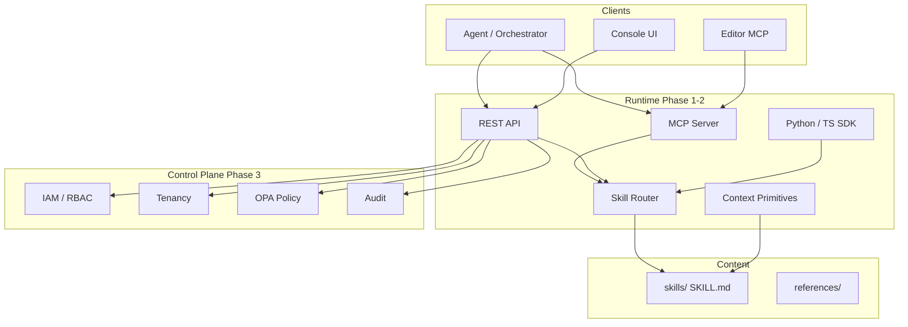

# Architecture

## System layers



## Progressive disclosure in the loader

1. **Index** — `list_skills()` reads frontmatter only (cheap).
2. **Body** — `get_skill(name)` loads SKILL.md.
3. **References** — `get_reference(name, path)` loads on demand.

The Skill Router builds a lexical index from the same files (offline).

## Single implementation rule

MCP, REST, SDKs, and demos call **one** loader/router/primitives implementation in `runtime/core/context_skills/`. No duplicated business logic in surfaces.

## Deployment modes (Phase 3)

| Mode | Description |
|------|-------------|
| SaaS | Shared multi-tenant cluster |
| Customer VPC | Terraform module + dedicated region |
| Air-gapped | Offline bundle, embedded OPA, file vault |

See [Enterprise deployment](ENTERPRISE.md) and `deploy/`.

## Repository layout

```
skills/           # 28 Agent Skills (content)
runtime/          # MCP, REST, SDKs, primitives
researcher/       # Gates, benchmarks, corpus
control-plane/    # IAM, tenancy, policy, console
deploy/           # Helm, Terraform, air-gapped
docs/             # This documentation site
examples/demo/    # Runnable proof scripts
```
