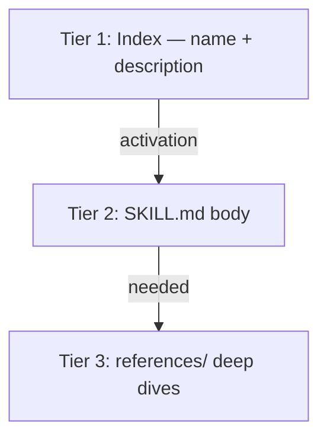

# Concepts

Context engineering is the discipline of curating what enters an LLM's window: system prompts, tools, retrieval, history, and observations — under fixed attention limits.

## Core techniques (this project)

| Technique | Skill | What it does |
|-----------|-------|--------------|
| Progressive disclosure | `context-fundamentals` | Load name + description first; full SKILL.md on activation |
| Observation masking | `context-optimization` | Replace verbose tool output with compact summaries |
| Hierarchical compaction | `context-compression` | Tier history by age/relevance |
| Handoff summaries | `context-compression` | Structured state for agent-to-agent transfer |
| Tool schema optimization | `tool-design` | Plain-language tool lists vs. heavy JSON |
| Context budgeting | `context-optimization` | Fit components under a token cap by priority |
| Filesystem offloading | `filesystem-context` | Large artifacts on disk; references in context |

## Progressive disclosure tiers

## Runtime primitives

Phase 2 exposes these as callable services (REST, MCP, SDK):

- `mask_observation`
- `compact_session` (hierarchical, handoff_summary, selective_retention)
- `budget_context`
- `optimize_format`
- `run_context_pipeline` (combined optimization)

All run **offline by default** (deterministic fallback LLM for summarization paths).

## Skill Router

Lexical, deterministic routing over skill names and descriptions — no network, no API keys. Used by the demo, MCP `route_task`, and REST `POST /route`.

## Platform skills

Each supported agent platform (Copilot, Cursor, Kiro, Antigravity, Amazon Q) has three skills: **context architecture**, **session management**, and **customization** — documenting how that platform loads and manages context.
